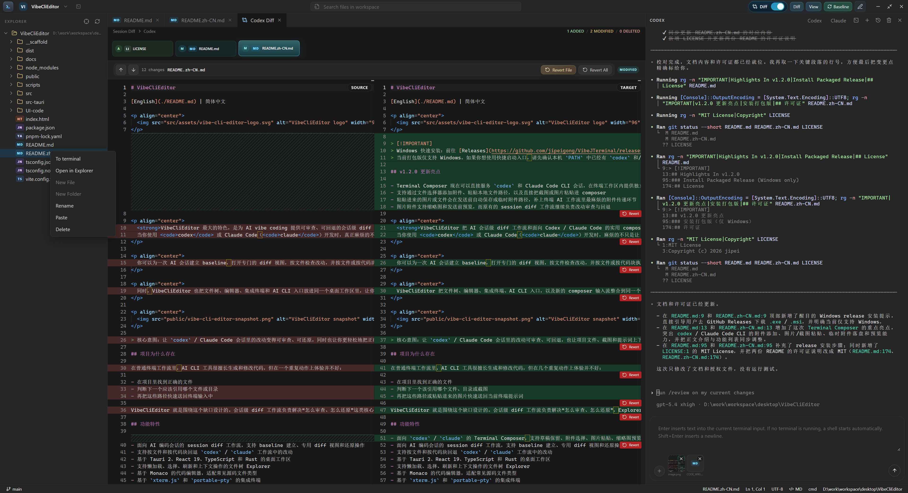
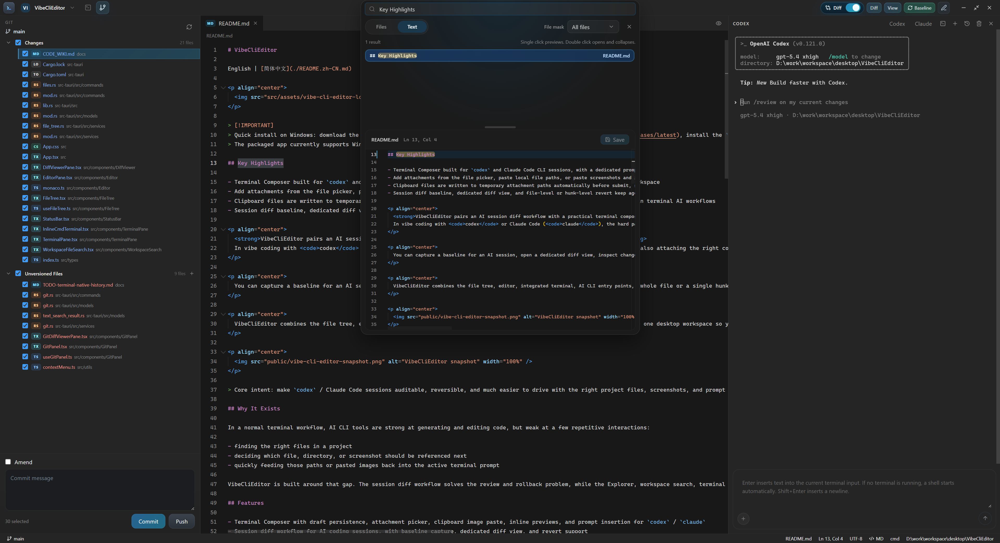

# VibeCliEditor

English | [简体中文](./README.zh-CN.md)

> [!TIP]
> Development and verification are currently done on Windows machines only, so macOS is not supported for now. If you need macOS support, feel free to modify the code yourself or open a branch and submit a PR.

<p align="center">
  
</p>

> [!IMPORTANT]
> Quick install on Windows: download the latest packaged build from [Releases](https://github.com/jipeigong/VibeJTerminal/releases/latest), install the `.exe` or `.msi` asset, then make sure `codex` and/or `claude` is available in your `PATH`.
> The packaged app currently supports Windows only.

## Key Highlights

- Terminal Composer built for `codex` and Claude Code CLI sessions, with a dedicated prompt input area inside the terminal workspace
- Add attachments from the file picker, paste local file paths, or paste screenshots and images directly from the clipboard
- Clipboard files are written to temporary attachment paths automatically before submit, so attachment handoff works cleanly in terminal AI workflows
- Session diff baseline, dedicated diff view, and file-level or hunk-level revert keep agent changes auditable and reversible

<p align="center">
  <strong>VibeCliEditor pairs an AI session diff workflow with a practical terminal composer for Codex and Claude Code.</strong>
  In vibe coding with <code>codex</code> or Claude Code (<code>claude</code>), the hard part is not only generating code, but also attaching the right context, reviewing what the agent changed, and safely rolling it back. VibeCliEditor makes those terminal-driven interactions visible, reviewable, and reversible inside one workspace.
</p>

<p align="center">
  You can capture a baseline for an AI session, open a dedicated diff view, inspect changes file by file, and revert either a whole file or a single hunk. You can also prepare prompts with file attachments, pasted images, and workspace path inserts before sending them into the active CLI session.
</p>

<p align="center">
  VibeCliEditor combines the file tree, editor, integrated terminal, AI CLI entry points, and the new composer input flow into one desktop workspace so you can browse files, select targets, inspect diffs, attach the right files, and keep the whole workflow in one place.
</p>

<p align="center">
  
</p>

<p align="center">
  
</p>

> Core intent: make `codex` / Claude Code sessions auditable, reversible, and much easier to drive with the right project files, screenshots, and prompt context.

## Why It Exists

In a normal terminal workflow, AI CLI tools are strong at generating and editing code, but weak at a few repetitive interactions:

- finding the right files in a project
- deciding which file, directory, or screenshot should be referenced next
- quickly feeding those paths or pasted images back into the active terminal prompt

VibeCliEditor is built around that gap. The session diff workflow solves the review and rollback problem, while the Explorer, workspace search, terminal integration, and composer attachment flow make it much easier to find files and bring the right context into the active AI session.

## Features

- Terminal Composer with draft persistence, attachment picker, clipboard image paste, inline previews, and prompt insertion for `codex` / `claude`
- Session diff workflow for AI coding sessions, with baseline capture, dedicated diff view, and revert support
- File-level and hunk-level rollback for changes made during `codex` / `claude` workflows
- Desktop workspace built with Tauri 2, React 19, TypeScript, and Rust
- File tree Explorer with lazy loading, selection, refresh, and context actions
- Monaco-based code editor for common source file types
- Integrated terminal powered by `xterm.js` and `portable-pty`
- Quick launch entry points for local AI CLIs such as `codex` and `claude`
- Workspace file search from the title bar
- File-path insertion flow designed for terminal-first AI coding
- Recent workspace switching and multi-window project opening

## Preview

The current project is closer to a focused desktop coding workspace than a full IDE. The emphasis is on local workflow efficiency, especially around terminal-driven AI development.

## Tech Stack

| Layer | Stack |
| --- | --- |
| Desktop Shell | Tauri 2 |
| Frontend | React 19 + TypeScript + Vite 7 |
| Editor | Monaco Editor |
| Terminal Rendering | xterm.js |
| Layout | react-resizable-panels |
| Backend | Rust |
| PTY | portable-pty |
| Icons | lucide-react |

## Project Structure

```text
VibeCliEditor/
|-- src/                # React frontend
|-- src-tauri/          # Tauri + Rust backend
|-- public/             # Static assets
|-- scripts/            # Development helper scripts
|-- docs/               # Additional project docs
|-- package.json
`-- README.md
```

## Getting Started

### Install Packaged Release (Windows only)

- Download the latest packaged build from [Releases](https://github.com/jipeigong/VibeJTerminal/releases/latest)
- Install the `.exe` or `.msi` asset
- Make sure `codex` and/or `claude` is available in your local `PATH` if you want to use the quick-launch actions

### Requirements For Source Development

- Node.js
- pnpm
- Rust toolchain
- Tauri development environment

The project and the packaged app are currently developed and validated primarily on Windows desktop.

### Install Dependencies

```bash
pnpm install
```

### Run In Development

```bash
pnpm tauri dev
```

If you only want the frontend dev server:

```bash
pnpm dev
```

### Build

```bash
pnpm build
pnpm tauri build
```

## Usage Notes

- When no recent workspace exists, the app stays empty until you open a folder yourself.
- The Explorer can be used to locate files and push selected paths into the terminal workflow.
- The integrated terminal is intended to work well with local AI CLIs already installed on your machine.
- The title-bar workspace switcher supports opening additional projects in new windows.

Make sure these commands are available in your local `PATH` if you want to use the quick-launch terminal actions:

- `codex`
- `claude`

## Development Notes

The repository includes `scripts/run-tauri.mjs` to help normalize local Tauri execution, including:

- injecting `VIBE_CLI_EDITOR_PROJECT_ROOT`
- using an isolated Cargo target directory
- reducing stale process issues on Windows

## Roadmap

- Add file watching and smarter refresh behavior
- Improve terminal workspace synchronization
- Expand editor capabilities such as formatting and diff workflows
- Add settings, shortcuts, and theme customization
- Improve packaging, testing, and release workflows

## Contributing

Issues and pull requests are welcome.

Useful contribution areas:

- file insertion workflow for AI terminal usage
- Explorer and workspace interaction details
- editor usability improvements
- terminal behavior and cross-platform compatibility

## License

VibeCliEditor is licensed under the MIT License. See [LICENSE](./LICENSE).

## Acknowledgements

- [Tauri](https://tauri.app/)
- [React](https://react.dev/)
- [Monaco Editor](https://microsoft.github.io/monaco-editor/)
- [xterm.js](https://xtermjs.org/)
