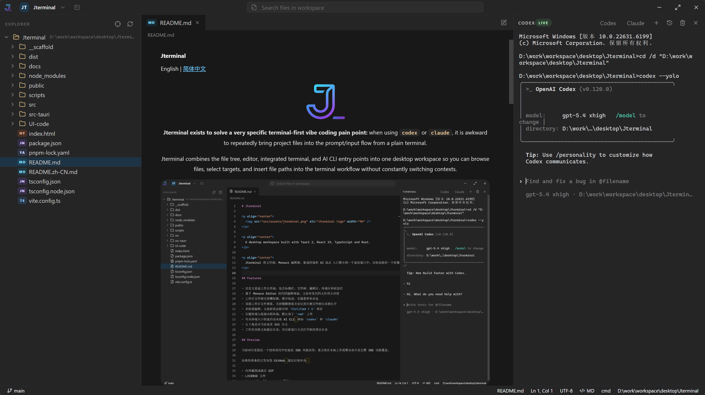

# Jterminal

[English](./README.md) | 简体中文

<p align="center">
  
</p>

<p align="center">
  <strong>Jterminal 的核心目标，是解决终端优先的 vibe coding 里一个很具体的痛点：</strong>
  当你使用 <code>codex</code> 或 <code>claude</code> 时，很难在纯终端环境里高频、顺手地把项目文件持续带入输入流。
</p>

<p align="center">
  Jterminal 把文件树、编辑器、集成终端和 AI CLI 入口放进同一个桌面工作区里，让你可以浏览文件、选中目标，并把文件路径快速送进终端工作流，而不需要在多个窗口和上下文之间来回切换。
</p>

<p align="center">
  
</p>

> 核心意图：让你在 `codex` / `claude` 的终端会话里更轻松地引用项目文件，尤其是在 AI 驱动的开发循环中，需要不断把文件和路径带入上下文的时候。

## 项目为什么存在

在普通终端工作流里，AI CLI 工具很擅长生成和修改代码，但在一个重复动作上体验并不好：

- 在项目里找到正确的文件
- 判断下一个应该引用哪个文件或目录
- 再把这些路径快速送回终端输入中

Jterminal 就是围绕这个缺口设计的。左侧 Explorer 和工作区搜索负责更快定位文件，终端集成则负责把选中的路径更顺手地送进当前终端会话。

## 功能特性

- 基于 Tauri 2、React 19、TypeScript 和 Rust 的桌面工作区
- 支持懒加载、选择、刷新和上下文操作的文件树 Explorer
- 基于 Monaco 的代码编辑器，适配常见源码文件类型
- 基于 `xterm.js` 和 `portable-pty` 的集成终端
- 面向本地 AI CLI 的快速启动入口，例如 `codex` 和 `claude`
- 位于标题栏的工作区文件搜索
- 面向终端优先 AI 编码场景设计的文件路径插入流
- 最近工作区切换和多窗口打开项目能力

## 预览

当前项目更接近一个聚焦型桌面编码工作区，而不是完整 IDE。重点放在本地工作流效率，尤其是终端驱动的 AI 开发体验。

## 技术栈

| 层级 | 技术 |
| --- | --- |
| 桌面壳层 | Tauri 2 |
| 前端 | React 19 + TypeScript + Vite 7 |
| 编辑器 | Monaco Editor |
| 终端渲染 | xterm.js |
| 布局 | react-resizable-panels |
| 后端 | Rust |
| PTY | portable-pty |
| 图标 | lucide-react |

## 项目结构

```text
Jterminal/
|-- src/                # React 前端
|-- src-tauri/          # Tauri + Rust 后端
|-- public/             # 静态资源
|-- scripts/            # 开发辅助脚本
|-- docs/               # 额外文档
|-- package.json
`-- README.md
```

## 快速开始

### 环境要求

- Node.js
- pnpm
- Rust toolchain
- Tauri development environment

当前项目主要在 Windows 桌面环境下开发和验证。

### 安装依赖

```bash
pnpm install
```

### 开发模式运行

```bash
pnpm tauri dev
```

如果你只想启动前端开发服务器：

```bash
pnpm dev
```

### 构建

```bash
pnpm build
pnpm tauri build
```

## 使用说明

- 当没有最近工作区时，应用会保持空状态，等待你自己打开文件夹
- 你可以通过 Explorer 定位文件，并把选中的路径送进终端工作流
- 集成终端的设计目标，是更顺滑地配合本机已安装的 AI CLI 使用
- 标题栏的工作区切换器支持以新窗口方式打开其它项目

如果你想使用终端里的快捷启动入口，请确保这些命令已经在本机 `PATH` 中可用：

- `codex`
- `claude`

## 开发说明

仓库里的 `scripts/run-tauri.mjs` 会帮助规范本地 Tauri 执行流程，包括：

- 注入 `JTERMINAL_PROJECT_ROOT`
- 使用独立的 Cargo target 目录
- 在 Windows 下减少陈旧进程带来的干扰

## 路线图

- 增加文件监听与更智能的刷新机制
- 改进终端与工作区目录同步
- 扩展编辑器能力，例如格式化和 diff 工作流
- 增加设置、快捷键和主题定制
- 完善打包、测试和发布流程

## 参与贡献

欢迎提交 issue 和 pull request。

适合优先投入的方向：

- 面向 AI 终端使用场景的文件插入工作流
- Explorer 与工作区交互细节
- 编辑器可用性增强
- 终端行为与跨平台兼容性

## 许可证

当前仓库还没有附带 `LICENSE` 文件。

如果你准备公开发布，建议在发布前补上一份明确的开源许可证，例如：

- MIT
- Apache-2.0
- GPL-3.0

## 致谢

- [Tauri](https://tauri.app/)
- [React](https://react.dev/)
- [Monaco Editor](https://microsoft.github.io/monaco-editor/)
- [xterm.js](https://xtermjs.org/)
